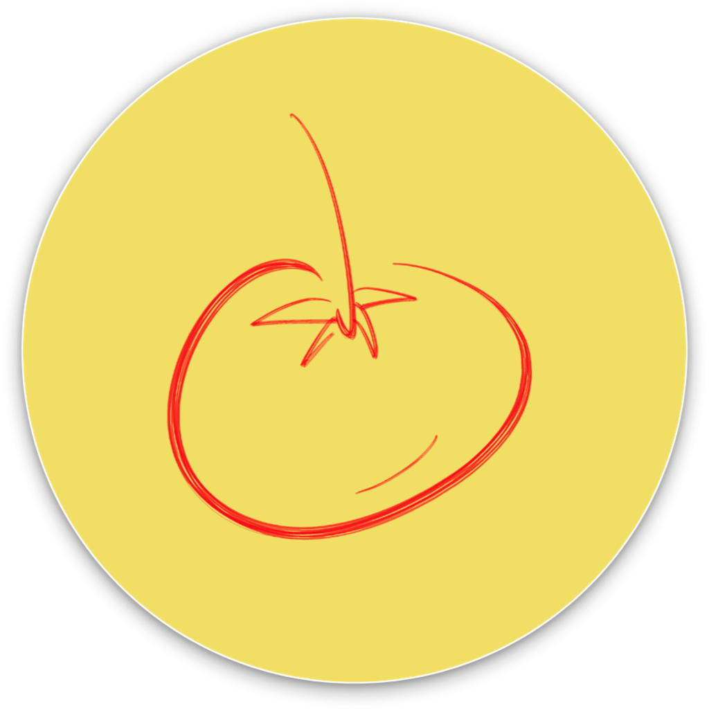

#  Focalizzare

Focalizzare with Pomodoro Technique.

 

💽 Download Unlimited Free Trial Forever

   <a style="float:right;" href="https://github.com/VitoVan/focalizzare/releases/latest">old macOS?</a>

Or

🛒 [Buy Focalizzare](https://www.buymeacoffee.com/vitovan/e/118618)

[Focalizzàre](https://en.wiktionary.org/wiki/focalizzare):  /fo.ka.lidˈd͡za.re/, to put into **focus**

[Pomodoro](https://en.wiktionary.org/wiki/pomodoro):  /ˌpo.moˈdɔ.ro/, **tomato**

[Pomodoro Technique](https://en.wikipedia.org/wiki/Pomodoro_Technique) in short:

1. Decide a task
2. Work for 25 minutes
3. Break for 5 minutes
4. Repeat 2-3, if it comes to the 4th break, make it 20 minutes

Made with [Hemorrhoid](https://en.wikipedia.org/wiki/Hemorrhoid) and [CALM](https://github.com/VitoVan/calm)

